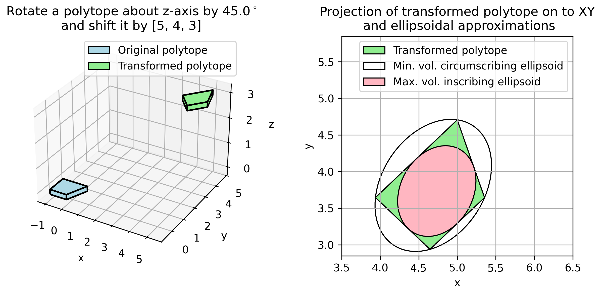
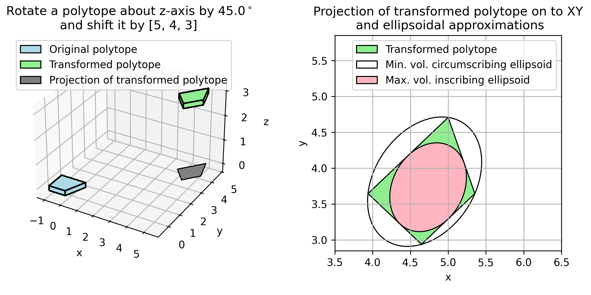

<!--
Copyright (C) 2020-2026 Mitsubishi Electric Research Laboratories (MERL)
Copyright (c) 2019 Tor Aksel N. Heirung

SPDX-License-Identifier: AGPL-3.0-or-later
SPDX-License-Identifier: MIT
-->

# pycvxset: Convex sets in Python

- [pycvxset: Convex sets in Python](#pycvxset-convex-sets-in-python)
  - [What is pycvxset?](#what-is-pycvxset)
  - [Quick start](#quick-start)
    - [Requirements](#requirements)
    - [Installation](#installation)
    - [Optional: Testing](#optional-testing)
    - [Optional: Documentation](#optional-documentation)
  - [Getting help](#getting-help)
  - [Contributing](#contributing)
  - [License](#license)
  - [Acknowledgements](#acknowledgements)
  - [Citing](#citing)
  - [Contact](#contact)

## What is pycvxset?

pycvxset (pronounced "Pie CVX Set") is a Python package for manipulation and visualization of convex sets. The code is
open-source (see [https://github.com/merlresearch/pycvxset](https://github.com/merlresearch/pycvxset)), and is
maintained by [Abraham P.  Vinod](http://merl.com/people/vinod).

Currently, pycvxset supports the following three representations:
1. **polytopes**,
2. **ellipsoids**, and
3. **constrained zonotopes** (which are equivalent to polytopes).

Some of the operations enabled by pycvxset include:
* construct sets from a variety of representations and transform between these representations,
* perform various operations on these sets including (but not limited to):
  * plot sets in 2D and 3D,
  * affine and inverse-affine transformation,
  * checking for containment,
  * intersection,
  * Minkowski sum,
  * Pontryagin difference,
  * projection,
  * slicing, and
  * support function evaluation.


See the Jupyter notebooks in [examples](https://github.com/merlresearch/pycvxset/tree/main/examples) folder for more details on how pycvxset can be used in set-based control and perform reachability analysis.

## Quick start

### Requirements

pycvxset supports Python 3.9+ on Ubuntu, Windows, and MacOS. As described in [pyproject.toml](https://github.com/merlresearch/pycvxset/blob/main/pyproject.toml), pycvxset has the following core dependencies:
1. [numpy](https://numpy.org/)
2. [scipy](https://scipy.org/)
3. [cvxpy](http://www.cvxpy.org/)
4. [matplotlib](https://matplotlib.org/)
5. [pycddlib](https://pycddlib.readthedocs.io/en/latest/): pycvxset requires `pycddlib>=3.0.0`. Use `pycvxset<=1.0.2` to use `pycvxset` with earlier versions of `pycddlib<=2.1.8.post1`.
6. [gurobipy](https://pypi.org/project/gurobipy/): This dependency is **optional**. Almost all functionalities of pycvxset are available without [Gurobi](https://www.gurobi.com/). However, pycvxset uses [Gurobi](https://www.gurobi.com/) (through [cvxpy](http://www.cvxpy.org/)) to perform *some* containment and equality checks involving constrained zonotopes. See [License](#license) section for more details.

### Installation

Refer to [.github/workflows](https://github.com/merlresearch/pycvxset/tree/main/.github/workflows) for exact steps to install pycvxset for different OSes. These steps are summarized below:
1. OS-dependent pre-installation steps:
   * **Ubuntu**: Install [gmp](https://gmplib.org/).
     ```
     $ sudo apt-get install libgmp-dev libcdd-dev python3-dev
     ```
     See [pycddlib documentation](https://pycddlib.readthedocs.io/en/latest/quickstart.html#installing-cddlib-and-gmp) or [pycddlib/build.yml](https://github.com/mcmtroffaes/pycddlib/blob/master/.github/workflows/build.yml) for more details.
   * **MacOS**: Install [gmp](https://gmplib.org/) and [cddlib](https://formulae.brew.sh/formula/cddlib).
     ```
     % brew install gmp cddlib
     % python3 -m pip install --upgrade pip
     % env "CFLAGS=-I$(brew --prefix)/include -L$(brew --prefix)/lib" python -m pip install pycddlib==3.0.0
     ```
     See [pycddlib documentation](https://pycddlib.readthedocs.io/en/latest/quickstart.html#installing-cddlib-and-gmp) or [pycddlib/build.yml](https://github.com/mcmtroffaes/pycddlib/blob/master/.github/workflows/build.yml) for more details.
   * **Windows**: No special steps required since pip takes care of it. If plotting fails, you can set matplotlib backend via an environment variable `set MPLBACKEND=Agg`.
     See [https://matplotlib.org/3.5.1/users/explain/backends.html#selecting-a-backend](https://matplotlib.org/3.5.1/users/explain/backends.html#selecting-a-backend) for more details.
2. Clone the pycvxset repository into a desired folder `PYCVXSET_DIR`.
3. Run `pip install -e .` in the folder `PYCVXSET_DIR`.

**Sanity check**: Check your installation by running  `python3 examples/pycvxset_diag.py` in the folder `PYCVXSET_DIR`. The script should generate a figure with two subplots, each generated using pycvxset.
  - *Left subplot*: A 3D plot of two polytopes (one at the origin, and the other translated and rotated). You can interact with this plot using your mouse.
  - *Right subplot*: A 2D plot of the projection of the polytope, and its corresponding minimum volume circumscribing and maximum volume inscribing ellipsoids.




The following code block is reproduced from `run_demo` function in [examples/pycvxset_diag.py](https://github.com/merlresearch/pycvxset/blob/main/examples/pycvxset_diag.py). The code block demonstrates how one can use `pycvxset` to define sets and manipulate them:

```python
# Copyright (C) 2020-2026 Mitsubishi Electric Research Laboratories (MERL)

import numpy as np
from pycvxset import Ellipsoid, Polytope
from scipy.spatial.transform import Rotation

# Define P as the intersection of a box with different sides and a halfspace
box_with_different_sides = Polytope(c=[0, 0, 0], h=[1, 0.5, 0.1])
P = box_with_different_sides.intersection_with_halfspaces([1, -0.5, 0], 0.25)
# Affine transformation (Rotate and translate P)
rotate_angle = np.pi / 4
R = Rotation.from_rotvec(rotate_angle * np.array([0, 0, 1])).as_matrix()
shift_vec = [5, 4, 3]
transformed_P = R @ P + shift_vec
# Projection (Compute its shadow on to the xy space)
project_transformed_P_to_XY = transformed_P.projection(project_away_dims=2)
# Centering ellipsoids
ellipsoid_inside_projection = Ellipsoid.deflate(project_transformed_P_to_XY)
ellipsoid_outside_projection = Ellipsoid.inflate(project_transformed_P_to_XY)
```

### Optional: Testing

1. Use `pip install -e ".[with_tests]"` to install the additional dependencies.
2. Run `$ ./scripts/run_tests_and_update_docs.sh` to view testing results on the command window.
3. View code coverage from testing at `./docs/build/_static/codecoverage/overall/index.html` on your browser.

### Optional: Documentation

1. Use `pip install -e ".[with_docs_and_tests]"` to install the additional dependencies.
2. To produce the documentation,
      * Run `$./scripts/run_all.sh`. This should take about 15 minutes. For **faster but incomplete options**,
        * To generate just the latex files for the
        [MANUAL.pdf](https://github.com/merlresearch/pycvxset/blob/main/MANUAL.pdf), run
        `$./scripts/run_sphinx_pdf.sh`. This command will assume that the environment has
        [LaTeX](https://www.tug.org/texlive/) setup properly.
        * To build the API documentation without rendering the notebooks or coverage results, run `$./scripts/run_sphinx_html.sh`.
1. View the documentation as,
      * PDF at [./MANUAL.pdf](https://github.com/merlresearch/pycvxset/blob/main/MANUAL.pdf)
      * HTML pages (without internet) at `localhost:8000` after running `python -m http.server --directory ./docs/build/`.
        * Documentation website is available at `./docs/build/index.html`.
        * View the Jupyter notebooks at `./docs/build/tutorials/tutorials.html`.
        * View code coverage from testing at `./docs/build/_static/codecoverage/overall/index.html`.

## Getting help

See [MANUAL.pdf](https://github.com/merlresearch/pycvxset/blob/main/MANUAL.pdf) or [https://merlresearch.github.io/pycvxset/](https://merlresearch.github.io/pycvxset/) for documentation of pycvxset.

Please use the [Discussion page](https://github.com/merlresearch/pycvxset/discussions) or the
[Issue page](https://github.com/merlresearch/pycvxset/issues), if you still need help.


## Contributing

See [CONTRIBUTING.md](https://github.com/merlresearch/pycvxset/blob/main/CONTRIBUTING.md) for our policy on contributions.

## License

pycvxset code is released under `AGPL-3.0-or-later` license, as found in the [LICENSE.md](https://github.com/merlresearch/pycvxset/blob/main/LICENSE.md) file. The documentation for pycvxset is released under `CC-BY-4.0` license, as found in the [LICENSES/CC-BY-4.0.md](https://github.com/merlresearch/pycvxset/blob/main/LICENSES/CC-BY-4.0.md).

All files:
```
Copyright (c) 2020-2026 Mitsubishi Electric Research Laboratories (MERL).

SPDX-License-Identifier: AGPL-3.0-or-later
```
except the following files:
1. .gitignore
1. README.md
1. pycvxset/Polytope/\_\_init\_\_.py
1. pycvxset/Polytope/operations_binary.py
1. pycvxset/Polytope/operations_unary.py
1. pycvxset/Polytope/plotting_scripts.py
1. pycvxset/Polytope/vertex_halfspace_enumeration.py
1. pycvxset/\_\_init\_\_.py
1. pycvxset/common/\_\_init\_\_.py
1. tests/test\_polytope\_binary.py
1. tests/test\_polytope\_init.py
1. tests/test\_polytope\_vertex_facet_enum.py

which have the copyright
```
Copyright (C) 2020-2026 Mitsubishi Electric Research Laboratories (MERL)
Copyright (c) 2019 Tor Aksel N. Heirung

SPDX-License-Identifier: AGPL-3.0-or-later
SPDX-License-Identifier: MIT
```

The method `contains` in [pycvxset/ConstrainedZonotope/operations_binary.py](https://github.com/merlresearch/pycvxset/blob/main/pycvxset/ConstrainedZonotope/operations_binary.py) uses [gurobipy](https://pypi.org/project/gurobipy/) (through [cvxpy](http://www.cvxpy.org)) and requires acceptance of appropriate license terms.

## Acknowledgements

The development of pycvxset started from commit
[ebd85404](https://github.com/heirung/pytope/commit/ebd85404ba235e8223fca1f6ba8817decccc4797) of
[pytope](https://github.com/heirung/pytope.git).
```
Copyright (c) 2019 Tor Aksel N. Heirung

SPDX-License-Identifier: MIT
```

pycvxset extends [pytope](https://github.com/heirung/pytope.git) in several new directions, including:
- Plotting for 3D polytopes using [matplotlib](https://matplotlib.org/stable/gallery/mplot3d/index.html),
- Interface with [cvxpy](http://www.cvxpy.org/) for access to a wider range of solvers,
- Introduce new methods for *Polytope* class including circumscribing and inscribing ellipsoids, volume computation, and containment checks,
- Minimize the use of vertex-halfspace enumeration using convex optimization,
- Include extensive documentation and example Jupyter notebooks,
- Implement exhaustive testing with nearly 100% coverage, and
- Support for *Ellipsoid* and *ConstrainedZonotope* set representations.

## Citing

If you use this software in your research, please cite it using the metadata from [CITATION.cff](https://github.com/merlresearch/pycvxset/tree/main/CITATION.cff) or the following bibtex entry.

```
@inproceedings{vinod2024pycvxset,
  title={{pycvxset: A Python package for convex set manipulation}},
  author={Vinod, Abraham P},
  booktitle={Proceedings of American Control Conference (ACC)},
  year={2025},
  note = {(accepted)}
}
```

## Contact

For questions or bugs, contact Abraham P. Vinod (Email: [vinod@merl.com](mailto:vinod@merl.com), [abraham.p.vinod@ieee.org](mailto:abraham.p.vinod@ieee.org)).
